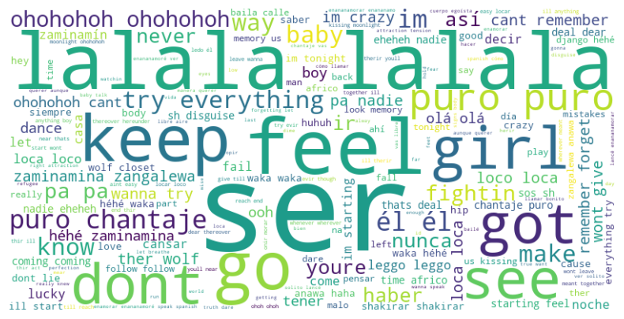

# Análisis semántico de letras de canciones de un artista




## 1. Descripción del proyecto
Este repositorio presenta un caso de aplicación de la minería de textos. En específico, explora los temas, emociones y evolución del lenguaje en las letras de un artista específico (Shakira).

## 2. Estado del proyecto


## 3. Tecnologías utilizadas


## 4. Guía de instalación
1. Agregar las extensiones: ```Jupyter``` y ```Python```  a su IDE de preferencia.

2. Clonar el repositorio en su IDE:
    ```
    https://github.com/caroSeminario23/Analisis_canciones.git
    ```
3. Crea un entorno virtual "venv"
4. Ejecuta los scripts de Jupyter
## 5. Licencia
[](./LICENSE)

## 6. Colaboradores
- Carolina Seminario Valdivia (caroSeminario23)
- Jamil Tuncar Quispe (JamilTuncarQ)
- Leo Soto Soto